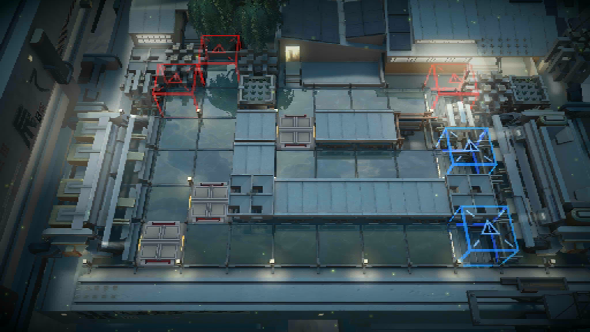
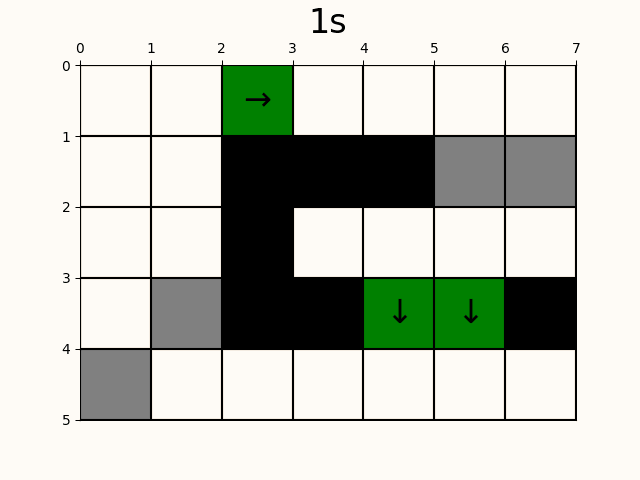

# arknights-huaishuli

明日方舟2024新春活动“怀黍离”地图机制演示,可生成给定地图和时间指令参数的水田污染简单演示动图

## 机制介绍

病害值：https://prts.wiki/w/%E7%89%B9%E6%AE%8A%E6%9C%BA%E5%88%B6

阻流阀：https://prts.wiki/w/%E9%98%BB%E6%B5%81%E9%98%80

泵站：https://prts.wiki/w/%E6%B3%B5%E7%AB%99

## 参数设置

### 地图参数

以 https://prts.wiki/w/HS-1_%E8%B5%B4%E5%A4%A7%E8%8D%92 地图（为演示所有装置存在一定差异）为例



```python
mapbox = # 略去最上方红门所在一行
[[1, 1, 'R', 1, 1, 1, 1],   # 在中间的不可部署高台放置向右的泵站
[1, 1, 0, 0, 0, -1, -1],    # 中间阻流阀改为高台，最右侧两个高台改为阻流阀
[1, 1, 0, 1, 1, 1, 1], 
[1, -1, 0, 0, 'D', 'D', 0], # 放置两个向下的泵站
[-1, 1, 1, 1, 1, 1, 1]]
```

在`mapbox`中各参数含义为：

 - 1：水田地块，包含红蓝门和不可部署地面
 - 0：封锁地块，包含高台地块和不可部署高台
 - -1：阻流阀
 - L：向左的一格泵站
 - R：向右的一格泵站
 - U：向上的一格泵站
 - D：向下的一格泵站

以地图左上角为起始坐标`(0,0)`，向右为横坐标正方向，向下为纵坐标正方向

你可以更改`mapbox`绘制自己的初始地图参数

### 操作参数

请更改`operate.txt`更改自己的操作参数，支持的参数包括：

 - [time] Pollute [x] [y] [value] : 在第[time]时刻坐标([x],[y])处增加[value]污染值，对应于游戏中 https://prts.wiki/w/%E7%A7%BD 等化物敌人的能力
 - [time] Block [x] [y] : 在第[time]时刻坐标([x],[y])处放置阻流阀
 - [time] Unblock [x] [y] : 在第[time]时刻撤去坐标([x],[y])处的阻流阀
 - [time] PutLeft [x] [y] : 在第[time]时刻坐标([x],[y])处放置向左的一格泵站
 - [time] PutRight [x] [y] : 在第[time]时刻坐标([x],[y])处放置向右的一格泵站
 - [time] PutUp [x] [y] : 在第[time]时刻坐标([x],[y])处放置向上的一格泵站
 - [time] PutDown [x] [y] : 在第[time]时刻坐标([x],[y])处放置向下的一格泵站
 - [time] Unput [x] [y] : 在第[time]时刻撤去坐标([x],[y])处的泵站

为了简便，此处压缩了时间尺度，每单位时刻对应5帧操作，设置的演示`gif`截止1501帧即300个时间单位，你可以更改`totaltime`参数

## 安装依赖
```
pip install -r requirements.txt
```

## 运行

```
python3 main.py
```

`./figs`目录下保存所有的地图帧，生成的`gif`将保存在`output.gif`



## 本项目仅供娱乐
